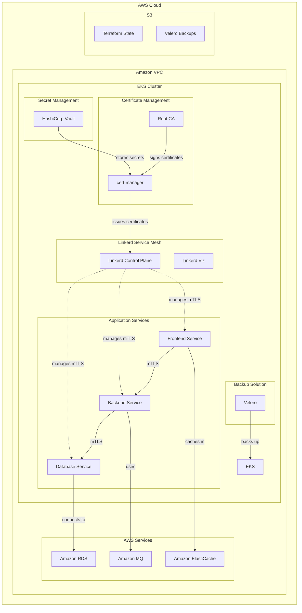

# mTLS Service Mesh Implementation

This repository contains the implementation of a mutual TLS (mTLS) service mesh to secure communication between services within a Kubernetes-based application environment. The solution leverages Linkerd (service mesh), cert-manager (certificate management), and Vault (secret management) to achieve robust, secure, and scalable service communication.

## Table of Contents

- [Project Overview](#project-overview)
- [Architecture](#architecture)
- [Prerequisites](#prerequisites)
- [Repository Structure](#repository-structure)
- [Implementation Steps](#implementation-steps)
  - [Stage 1: Building the Sandbox Environment](#stage-1-building-the-sandbox-environment)
  - [Stage 2: Testing the Sandbox with Application and mTLS](#stage-2-testing-the-sandbox-with-application-and-mtls)
- [Deployment Guide](#deployment-guide)
- [Testing and Validation](#testing-and-validation)
- [Troubleshooting](#troubleshooting)
- [Security Considerations](#security-considerations)
- [Future Enhancements](#future-enhancements)

## Project Overview

The primary objective of this project is to implement a mutual TLS (mTLS) service mesh that secures communication between services within a Kubernetes-based application environment and ensures the solution passes security audits. 

Key components:
- **Linkerd**: Lightweight service mesh that provides mTLS encryption and authentication
- **cert-manager**: Kubernetes add-on for automated certificate management
- **HashiCorp Vault**: Secure storage solution for managing secrets and certificates
- **Amazon EKS**: Managed Kubernetes service for container orchestration
- **Velero**: Backup and restore solution for Kubernetes clusters and resources

This implementation follows a progressive approach:
1. Build a sandbox environment for proof-of-concept
2. Test the implementation with a sample application
3. Extend to development, staging, and production environments (future stages)

## Architecture

The service mesh architecture follows a modern, security-focused design:



## Prerequisites

Before implementing this solution, ensure you have the following:

- AWS account with appropriate permissions
- AWS CLI configured with access credentials
- Terraform (v1.0.0 or later)
- kubectl (v1.20.0 or later)
- Helm (v3.5.0 or later)
- Linkerd CLI (v2.11.0 or later)

## Repository Structure

```
.
├── terraform/                  # Infrastructure as Code
│   └── main.tf                 # Main Terraform configuration
├── kubernetes/                 # Kubernetes manifests
│   ├── cert-manager/           # Certificate management resources
│   ├── vault/                  # Secret management resources
│   ├── linkerd/                # Service mesh resources
│   └── sample-app/             # Sample application resources
├── scripts/                    # Deployment and testing scripts
│   ├── deploy-test.sh          # Deployment script
│   └── test-mtls.sh            # mTLS testing script
└── docs/                       # Documentation
    └── implementation-guide.md # Detailed implementation guide
```

## Implementation Steps

### Stage 1: Building the Sandbox Environment

The sandbox environment serves as a proof-of-concept for the mTLS service mesh implementation.

1. **Infrastructure Setup**:
   - Deploy Amazon EKS cluster within a Virtual Private Cloud (VPC) using Terraform.
   - Configure an S3 bucket for Terraform state locking.
   - Provision AWS resources:
     - RDS for relational database needs
     - MQ for asynchronous messaging
     - ElastiCache for caching and performance improvement
   - Implement Velero for backup and restore capabilities.

2. **Key Components**:
   ```hcl
   # S3 bucket for Terraform state
   resource "aws_s3_bucket" "terraform_state" {
     bucket = "mtls-service-mesh-tf-state"
   }
   
   # VPC Module
   module "vpc" {
     source  = "terraform-aws-modules/vpc/aws"
     version = "~> 3.0"
     # Configuration details...
   }
   
   # EKS Module
   module "eks" {
     source  = "terraform-aws-modules/eks/aws"
     version = "~> 18.0"
     # Configuration details...
   }
   
   # AWS resources (RDS, MQ, ElastiCache)
   resource "aws_db_instance" "service_mesh_db" {
     # Configuration details...
   }
   
   resource "aws_mq_broker" "service_mesh_mq" {
     # Configuration details...
   }
   
   resource "aws_elasticache_cluster" "service_mesh_cache" {
     # Configuration details...
   }
   ```

3. **Backup Solution**:
   ```yaml
   apiVersion: helm.cattle.io/v1
   kind: HelmChart
   metadata:
     name: velero
     namespace: kube-system
   spec:
     repo: https://vmware-tanzu.github.io/helm-charts
     chart: velero
     targetNamespace: velero
     # Configuration details...
   ```

### Stage 2: Testing the Sandbox with Application and mTLS

With the sandbox environment in place, the focus shifts to implementing mTLS and testing with a sample application.

1. **Certificate Management**:
   - Install cert-manager for automated certificate issuance and renewal.
   - Configure a self-signed root CA for the development environment.
   - Set up certificate issuers and resources for Linkerd.

   ```yaml
   apiVersion: helm.cattle.io/v1
   kind: HelmChart
   metadata:
     name: cert-manager
     namespace: kube-system
   spec:
     repo: https://charts.jetstack.io
     chart: cert-manager
     version: v1.11.0
     # Configuration details...
   
   ---
   apiVersion: cert-manager.io/v1
   kind: ClusterIssuer
   metadata:
     name: selfsigned-issuer
   spec:
     selfSigned: {}
   
   ---
   apiVersion: cert-manager.io/v1
   kind: Certificate
   metadata:
     name: root-ca
     namespace: cert-manager
   spec:
     isCA: true
     # Configuration details...
   ```

2. **Secret Management**:
   - Install HashiCorp Vault for secure secret storage.
   - Configure Vault for Kubernetes authentication and PKI secrets.
   - Automate Vault initialization and configuration.

   ```yaml
   apiVersion: helm.cattle.io/v1
   kind: HelmChart
   metadata:
     name: vault
     namespace: kube-system
   spec:
     repo: https://helm.releases.hashicorp.com
     chart: vault
     version: 0.23.0
     # Configuration details...
   
   ---
   apiVersion: batch/v1
   kind: Job
   metadata:
     name: vault-init
     namespace: vault
   spec:
     # Vault initialization job details...
   ```

3. **Service Mesh Implementation**:
   - Install Linkerd as the service mesh solution.
   - Configure Linkerd with certificates from cert-manager.
   - Set up the control plane and visualization components.

   ```yaml
   apiVersion: helm.cattle.io/v1
   kind: HelmChart
   metadata:
     name: linkerd-crds
     namespace: kube-system
   spec:
     repo: https://helm.linkerd.io/stable
     chart: linkerd-crds
     version: 1.6.1
     # Configuration details...
   
   ---
   apiVersion: helm.cattle.io/v1
   kind: HelmChart
   metadata:
     name: linkerd-control-plane
     namespace: kube-system
   spec:
     repo: https://helm.linkerd.io/stable
     chart: linkerd-control-plane
     version: 1.6.1
     # Configuration details with certificate settings...
   ```

4. **Sample Application Deployment**:
   - Deploy a three-tier application (frontend, backend, database).
   - Enable Linkerd proxy injection for all application pods.
   - Configure ServiceProfiles and AuthorizationPolicies for mTLS enforcement.

   ```yaml
   apiVersion: v1
   kind: Namespace
   metadata:
     name: sample-app
     annotations:
       linkerd.io/inject: enabled
   
   ---
   apiVersion: apps/v1
   kind: Deployment
   metadata:
     name: frontend
     namespace: sample-app
   spec:
     # Deployment details with Linkerd annotations...
   
   ---
   apiVersion: policy.linkerd.io/v1beta1
   kind: AuthorizationPolicy
   metadata:
     name: backend-auth
     namespace: sample-app
   spec:
     # mTLS policy configuration...
   ```

## Deployment Guide

Follow these steps to deploy the mTLS service mesh solution:

1. **Clone the Repository**:
   ```bash
   git clone https://github.com/your-org/mtls-service-mesh.git
   cd mtls-service-mesh
   ```

2. **Apply Terraform Configuration**:
   ```bash
   cd terraform
   terraform init
   terraform apply
   ```

3. **Configure kubectl for EKS**:
   ```bash
   aws eks update-kubeconfig --name mtls-service-mesh-eks --region us-east-1
   ```

4. **Run the Deployment Script**:
   ```bash
   cd ../scripts
   chmod +x deploy-test.sh
   ./deploy-test.sh
   ```

5. **Verify the Deployment**:
   ```bash
   kubectl get pods -A
   linkerd check
   ```

6. **Run the Testing Script**:
   ```bash
   chmod +x test-mtls.sh
   ./test-mtls.sh
   ```

## Testing and Validation

The solution includes comprehensive testing to validate the mTLS implementation:

1. **Proxy Injection Verification**:
   - Ensure all pods have Linkerd proxy sidecars injected.
   - Verify that the proxies are properly configured for mTLS.

2. **mTLS Traffic Validation**:
   - Check that all service-to-service communication is secured with mTLS.
   - Verify encryption using Linkerd's visualization tools.

3. **Policy Enforcement Testing**:
   - Test that unauthorized access is properly blocked.
   - Verify that services with valid certificates can communicate.

4. **Certificate Validation**:
   - Ensure certificates are properly issued and valid.
   - Check certificate rotation and renewal.

5. **Service Communication Testing**:
   - Test end-to-end communication between frontend, backend, and database services.
   - Verify that the application functions correctly with mTLS enabled.

Example testing commands:
```bash
# Check Linkerd health
linkerd check

# View mTLS status between services
linkerd viz stat deploy -n sample-app

# Check service mesh traffic
linkerd viz edges deployment -n sample-app

# Test service-to-service communication
kubectl exec -it deploy/frontend -n sample-app -c frontend -- curl -s http://backend.sample-app.svc.cluster.local:80/api
```

## Troubleshooting

Common issues and their solutions:

1. **Certificate Issues**:
   - **Symptom**: Services fail to communicate with TLS errors.
   - **Solution**: Check cert-manager logs and certificate status.
   ```bash
   kubectl get certificates -A
   kubectl describe certificate linkerd-identity-issuer -n cert-manager
   ```

2. **Proxy Injection Problems**:
   - **Symptom**: Pods don't have Linkerd proxies.
   - **Solution**: Verify namespace and pod annotations.
   ```bash
   kubectl get ns sample-app -o yaml | grep linkerd
   kubectl get deployment frontend -n sample-app -o yaml | grep linkerd
   ```

3. **Authorization Failures**:
   - **Symptom**: Services receive 403 errors despite mTLS.
   - **Solution**: Check AuthorizationPolicy resources.
   ```bash
   kubectl get authorizationpolicy -n sample-app
   kubectl describe authorizationpolicy backend-auth -n sample-app
   ```

4. **Vault Integration Issues**:
   - **Symptom**: Secrets aren't properly available.
   - **Solution**: Check Vault status and initialization.
   ```bash
   kubectl exec -it vault-0 -n vault -- vault status
   kubectl logs job/vault-init -n vault
   ```

## Security Considerations

This implementation follows security best practices:

1. **Zero-Trust Security Model**:
   - All services must authenticate with valid certificates.
   - No service is trusted by default.

2. **Defense-in-Depth**:
   - Multiple security layers: VPC isolation, Kubernetes RBAC, mTLS, authorization policies.
   - Secrets are managed securely with Vault.

3. **Certificate Management**:
   - Automated issuance and rotation of certificates.
   - Short-lived certificates to minimize the risk of compromise.

4. **Policy Enforcement**:
   - Fine-grained access control with AuthorizationPolicies.
   - Service-to-service authentication requirements.

5. **Observability and Audit**:
   - Comprehensive logging and monitoring.
   - Visualization of all service mesh traffic.

## Future Enhancements

Planned enhancements for future stages:

1. **Development Environment Deployment**:
   - Implement CI/CD pipeline with GitHub Actions.
   - Set up ArgoCD for GitOps-based deployment.
   - Create Helmfiles for consistent deployment.

2. **Staging and Production Deployment**:
   - Configure environment-specific settings.
   - Implement progressive deployment strategies.
   - Set up integration and smoke tests.

3. **Performance Optimization**:
   - Tune Linkerd proxy settings for improved performance.
   - Optimize certificate rotation schedules.
   - Implement caching strategies for authentication.

4. **Additional Security Features**:
   - Implement network policies for additional traffic control.
   - Set up automated vulnerability scanning.
   - Configure audit logging for security events.

---

This mTLS service mesh implementation provides a robust, secure, and scalable solution for service-to-service communication within Kubernetes environments. By following the deployment guide and understanding the architecture, you can successfully implement secure microservices communication that meets security audit requirements.
